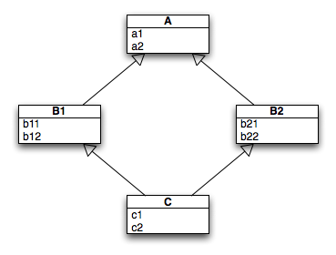

### Object-Oriented Scala ###


```scala
class Person(id: Int, name: String)
```
<aside class="notes">
        Trenger ikke body.
        Private felter.
</aside>


```scala
class Person(val id: Int, val name: String)
```
<aside class="notes">
        Kompilatoren genererer accessors (tilsvarende get)
</aside>


```scala
class Person(val id: Int, val name: String) {
  // def name(): String
  // def id(): Int
}
```
<aside class="notes">
        Transparant for klient om det er et felt eller en metode
</aside>


```scala
class Person(var id: Int, var name: String) {
  // def name(): String
  // def name_=(s: String): Unit

  // def age(): Int
  // def age_=(i: Int): Unit
}
```
<aside class="notes">
        Både setter og gettere
        Brukes sjelden i praksis, med unntak når du skal være Java-kompatibel
</aside>


```scala
class Person(@BeanProperty val id: Int,
             @BeanProperty val name: String) {
  // def getName(): String
  // def setName(name:String): Unit
  // def getId:Int
}
```
<aside class="notes">
        Kompatibel med Java, f.eks. Spring MVC og Hibernate som krever Javabean
</aside>


```scala
class Person(id: Int, name: String) {
  println("Person created")

  def this(id: Int, name: String, address: String) = {
    this(name, age)
  }
}
```
<aside class="notes">
        Konstruktor er i bodyen!
        Lage flere konstruktører med this, må kalle primær konstruktur først!
        Men - ser aldri bruk av this da det finnes bedre alternativer.
</aside>


```scala
class Person(val id: Int, val name: String, val address: Option[String])

object Person {

  def apply(id: Int, name: String, address: Option[String]) =
        new Person(id, name, address)

  def apply(id: Int, name: String) = new Person(id, name, None)

  def apply(name: String) = new Person(0, name, None)

}

```
```scala
scala> val p == Person(1, "Ola")
// p: Person = Person@306b208
```
<aside class="notes">
        Companion object - må være i samme fil (funker dårlig i REPL uten scoping)
        Ikke statiske metoder - object er singleton
</aside>


### Default arguments ###

```scala
class Person(val id: Int, val name: String, 
                    val address: Option[String] = None) {

  override def toString = "(" + id + ", " + name + ", " + address + ")"
}
```
```scala
scala> val p = new Person(1, "Ola", Some("Grensen 5-7"))
p: Person = (1, Ola, Some(Grensen 5-7))

scala> val p2 = new Person(2, "Kari")
p2: Person = (2, Kari, None)
```


### Named arguments ###
```scala
class Person(val id: Int, val name: String, 
                    val address: Option[String] = None) {

  override def toString = "(" + id + ", " + name + ", " + address + ")"
}
```
```scala
scala> val p = new Person(name="Ola", id=1)
p: Person = (1, Ola, None)
```


### Traits ###
```scala
trait DatabaseConnection {

}
```
<aside class="notes">
   Litt som interfaces is java - men veldig mye mer!
   Kan gjøre det samme som klasser, bare ikke konstruktorer
   Når skal man bruke traits og når klasser?
   - traits bra hvis det skal gjenbrukes i klasser som ikke har noe med hverandre å gjøre (cross-cutting conserns)
</aside>


### Diamond problem ###



```scala
trait C extends B1 with B2
```
<aside class="notes">
- multiple inheritance - ambiguity
- traits are mixins - not really inheritance - no ambiguity
- den siste mixet inn vinner
</aside>


```scala
trait DatabaseConnection {
  def db: DB
}

trait InMemoryDbConnection extends DatabaseConnection {
  lazy val db = H2Database{....}
}

trait BilforsikringDao extends DatabaseConnection {

}

trait BilforsikringDaoTest extends InMemoryDbConnection {

}

```


### Imports ###
```scala
import java.util.Date
import java.sql.{Date => SqlDate}
import java.sql._
```
<aside class="notes">
    Kan importere hvorsomhelst i fila
    Mulig å rename og ekskludere deler av scopet
</aside>
